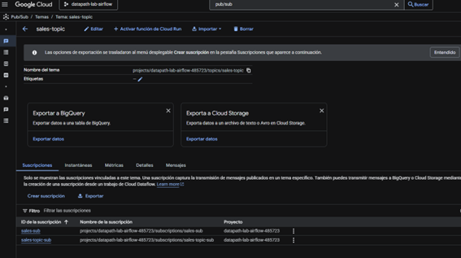
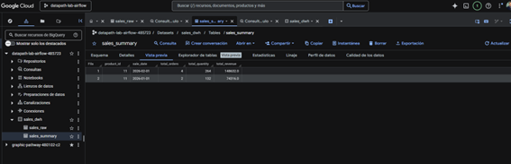
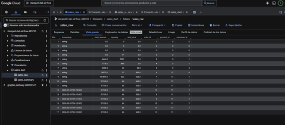
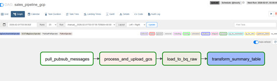

LUIS ANGEL APAZA QUISPE
## Descripción del Proyecto
El flujo del pipeline es el siguiente:

1. Una **API de ventas** (FastAPI) recibe órdenes vía HTTP (`POST /order`).
2. Cada orden se publica en un **Topic de Pub/Sub** (`sales-topic`).
3. Airflow consume los mensajes desde una **Suscripción Pull** (`sales-sub`).
4. Los mensajes se procesan y se almacenan como archivos **JSON** en **Cloud Storage**.
5. Los datos se cargan a **BigQuery** en la tabla `sales_raw`.
6. Se ejecuta una transformación que genera la tabla agregada `sales_summary`, con métricas de ventas por producto y fecha.
##  Tecnologías Utilizadas

- Apache Airflow
- Google Cloud Pub/Sub
- Google Cloud Storage
- Google BigQuery
- FastAPI
- Docker & Docker Compose
- Python
##  Instrucciones para Ejecutar el Proyecto

###  Requisitos previos
- Docker Desktop instalado
- Acceso a un proyecto en Google Cloud Platform
- Archivo de credenciales de Service Account (`credentials.json`)

### Primero levantamos los servicios de docjer compose
- docker compose up -d --build       --> desde la raiz 
- docker compose ps                  --> verificar si estan activos
### Verificar los servicios levantados 
- API de Ventas (Swagger): http://localhost:8081/docs
- Airflow UI:http://localhost:8090
### Pruebas en swagger
- En Swagger (POST /order), enviar múltiples ordenes en formato JSON
### Ejecucion de DAG
- Ingresar a Airflow.
- Activar el DAG sales_pipeline_gcp.
- Ejecutar el DAG manualmente con el botón Play.
### Validación con BIGQUERY
-Tabla RAW: sales_dwh.sales_raw
-Tabla agregada: sales_dwh.sales_summary
Comando para verificar la data
SELECT * FROM sales_dwh.sales_summary;

##  Evidencias de Ejecución

### GCP 1️ Pub/Sub: Topic y Suscripción
Captura de la consola de Google Cloud mostrando el **Topic `sales-topic`** y la **Suscripción `sales-sub`** creados.

---

### GCP 2️ BigQuery: Tabla `sales_summary`
Esquema de la tabla agregada `sales_summary` creada en BigQuery.

Consulta `SELECT *` mostrando los datos cargados.

---

### Airflow 1️ DAG ejecutado correctamente
Vista **Graph/Grid** del DAG `sales_pipeline_gcp` con todas las tareas en estado **Success**.

---

### Airflow 2️ Logs de procesamiento
Logs de la tarea `process_and_upload_gcs` evidenciando el procesamiento de mensajes desde Pub/Sub.

---

### API 1️ Envío de órdenes
Captura de **Swagger UI** mostrando una respuesta exitosa (**200 OK**) al enviar una orden mediante `POST /order`.

